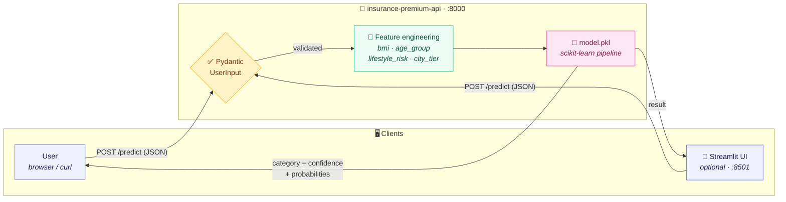
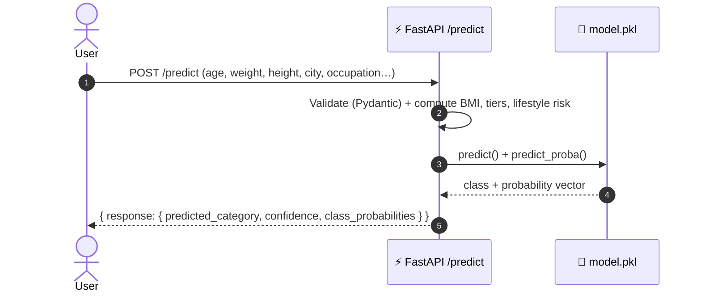
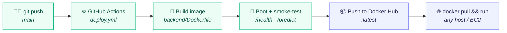

# 🏥 Insurance Premium Category Predictor

> A production-style machine-learning microservice that predicts an insurance **premium category** (Low / Medium / High) from a person's demographic and lifestyle profile — built with **FastAPI** + **scikit-learn**, packaged as a single portable **Docker image**, and shipped through a self-validating **GitHub Actions** CI/CD pipeline.

[](https://github.com/Amith-Ganta/FastAPI-ML-Docker-AWS/actions/workflows/deploy.yml)
[](https://hub.docker.com/r/tweakster24/insurance-premium-api)
[](https://www.python.org/downloads/)
[](https://fastapi.tiangolo.com/)
[](https://scikit-learn.org/)
[](#license)

---

## 🚀 Run it in 10 seconds

The service is published as a ready-to-run image on Docker Hub. No clone, no build, no Python toolchain required:

```bash
docker pull tweakster24/insurance-premium-api:latest
docker run -p 8000:8000 tweakster24/insurance-premium-api:latest
```

Then open the interactive API docs at **http://localhost:8000/docs** and try a live prediction.

```bash
curl -X POST http://localhost:8000/predict \
  -H "Content-Type: application/json" \
  -d '{"age":30,"weight":65,"height":1.7,"income_lpa":10,"smoker":true,"city":"Mumbai","occupation":"private_job"}'
```

```json
{
  "response": {
    "predicted_category": "Low",
    "confidence": 0.66,
    "class_probabilities": { "High": 0.01, "Low": 0.66, "Medium": 0.33 }
  }
}
```

---

## ✨ Highlights

- **Single source of truth** — the API ships as one immutable image, `tweakster24/insurance-premium-api:latest`. The same artifact runs on a laptop, in CI, and in production.
- **Rich, honest predictions** — every response returns not just the predicted class but a **confidence score** and the **full probability distribution** across all categories.
- **Self-validating CI/CD** — GitHub Actions builds the image, boots it, and smoke-tests `/health` and `/predict` against the real HTTP contract *before* publishing. A broken build never reaches Docker Hub.
- **Typed, self-documenting API** — Pydantic validates every field and auto-generates OpenAPI / Swagger docs at `/docs`.
- **Smart feature engineering** — raw inputs are transformed into the signals the model actually learned on: BMI, age group, lifestyle risk, and city tier.
- **Optional Streamlit UI** — a friendly web frontend for non-technical users, wired to the same API.

---

## 🧱 Tech Stack

| Layer | Technology |
|-------|-----------|
| API framework | FastAPI 0.115 |
| ML framework | scikit-learn 1.6 |
| Validation | Pydantic 2.11 |
| Data handling | pandas 2.2 |
| Packaging | Docker · Docker Compose |
| Registry | Docker Hub (`tweakster24/insurance-premium-api`) |
| CI/CD | GitHub Actions |
| Optional UI | Streamlit 1.43 |

---

## 🏗️ Architecture

### System overview



The core deliverable is a **stateless FastAPI container**. It validates the incoming payload with Pydantic, derives the engineered features the model was trained on, and runs them through a pre-trained scikit-learn pipeline loaded from `model.pkl`. Clients can be anything that speaks HTTP — `curl`, a notebook, another service, or the bundled Streamlit UI.

### Request lifecycle



### CI/CD pipeline



Every push to `main` (or a manual `workflow_dispatch`) builds the image, **runs it**, and asserts the live `/health` and `/predict` endpoints return the expected contract. Only a green build is published to Docker Hub. Deployment is then a simple, reproducible `docker pull && docker run` on any host — no brittle SSH-into-a-server step. See [docs/ARCHITECTURE.md](docs/ARCHITECTURE.md) for the design rationale.

---

## 📡 API Reference

### `GET /health`
Liveness probe used by Docker, CI smoke tests, and load balancers.

```json
{ "status": "healthy", "model_version": "1.0.0" }
```

### `POST /predict`
Predict the insurance premium category for a user profile.

**Request body**

```json
{
  "age": 30,
  "weight": 65.0,
  "height": 1.75,
  "income_lpa": 10.0,
  "smoker": false,
  "city": "Mumbai",
  "occupation": "private_job"
}
```

| Field | Type | Constraints |
|-------|------|-------------|
| `age` | int | `0 < age < 120` |
| `weight` | float | `> 0` (kg) |
| `height` | float | `0 < height < 2.5` (m) |
| `income_lpa` | float | `> 0` (lakhs/yr) |
| `smoker` | bool | — |
| `city` | string | any city name |
| `occupation` | enum | `retired`, `freelancer`, `student`, `government_job`, `business_owner`, `unemployed`, `private_job` |

**Response**

```json
{
  "response": {
    "predicted_category": "Low",
    "confidence": 0.66,
    "class_probabilities": { "High": 0.01, "Low": 0.66, "Medium": 0.33 }
  }
}
```

Full reference: [docs/API.md](docs/API.md). Interactive docs are served at `/docs` (Swagger) and `/redoc`.

---

## 🧠 The Model

The classifier doesn't consume raw inputs directly — it learns on **engineered features** derived inside the API:

| Engineered feature | Derived from |
|--------------------|--------------|
| `bmi` | weight / height² |
| `age_group` | young / adult / middle_aged / senior |
| `lifestyle_risk` | smoker status + BMI |
| `city_tier` | tier-1 / tier-2 / tier-3 city lookup |
| `income_lpa`, `occupation` | passed through |

The output is a discrete premium category plus a calibrated probability for **every** class, so consumers can act on confidence — not just the top label.

---

## 🛠️ Local Development

### Option A — Just the API (recommended)

```bash
docker pull tweakster24/insurance-premium-api:latest
docker run -p 8000:8000 tweakster24/insurance-premium-api:latest
# → http://localhost:8000/docs
```

### Option B — Full stack with Docker Compose (API + Streamlit UI)

```bash
git clone https://github.com/Amith-Ganta/FastAPI-ML-Docker-AWS.git
cd FastAPI-ML-Docker-AWS
docker compose up --build
# API:  http://localhost:8000/docs
# UI:   http://localhost:8501
```

### Option C — Bare metal (no Docker)

```bash
# Backend
cd backend && pip install -r requirements.txt
uvicorn app:app --reload --port 8000

# Frontend (separate terminal)
cd frontend && pip install -r requirements.txt
streamlit run frontend.py --server.port 8501
```

More detail in [docs/LOCAL_SETUP.md](docs/LOCAL_SETUP.md).

---

## 📁 Project Structure

```
FastAPI-ML-Docker-AWS/
├── backend/                   # FastAPI service (the published image)
│   ├── app.py                 # API: validation, feature engineering, inference
│   ├── model.pkl              # Trained scikit-learn pipeline
│   ├── Dockerfile             # Image definition
│   └── requirements.txt
│
├── frontend/                  # Optional Streamlit UI
│   ├── frontend.py
│   ├── Dockerfile.streamlit
│   └── requirements.txt
│
├── docs/                      # API, architecture, setup & deployment guides
├── data/                      # Training & sample data
├── scripts/                   # Helper scripts
├── .github/workflows/         # CI/CD: build → smoke-test → publish
│   └── deploy.yml
├── docker-compose.yml         # Full-stack local orchestration
└── README.md
```

---

## 🚢 Deployment

Because the API is a self-contained image, deploying anywhere is the same two commands:

```bash
docker pull tweakster24/insurance-premium-api:latest
docker run -d --name insurance-premium-api -p 8000:8000 \
  --restart unless-stopped tweakster24/insurance-premium-api:latest
```

This works identically on a laptop, a bare VM, AWS EC2, or any container platform. The full deployment playbook (including EC2 and security-group notes) lives in [docs/DEPLOYMENT.md](docs/DEPLOYMENT.md).

---

## 🩹 Troubleshooting

**Port 8000 already in use**
```bash
docker rm -f insurance-premium-api 2>/dev/null || true
```

**Check container logs**
```bash
docker logs insurance-premium-api
```

**Verify the service is up**
```bash
curl http://localhost:8000/health
```

---

## 📄 License

Released under the [MIT License](LICENSE). © 2026 Amith Ganta.
