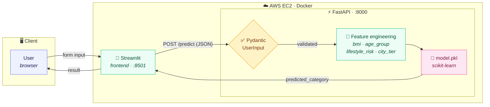
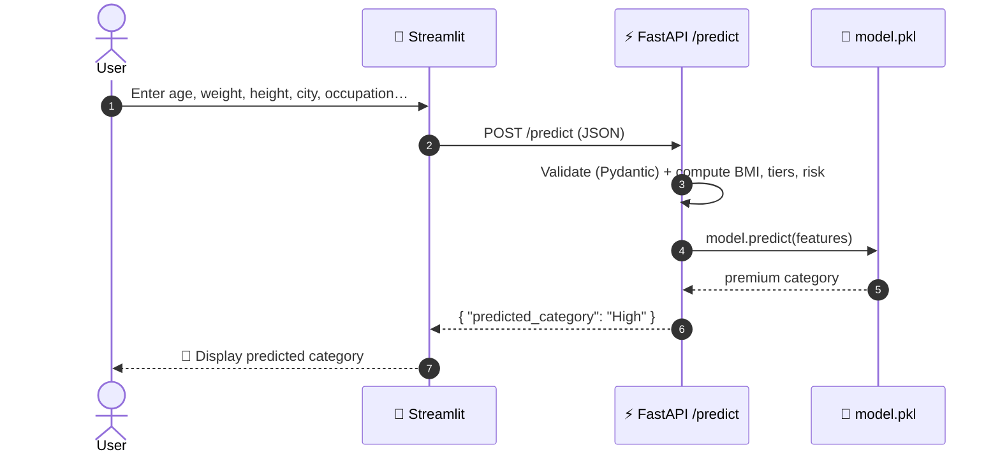

# 🏥 Insurance Premium Category Predictor

> A full-stack machine learning app that predicts insurance premium categories from user demographics and health metrics — **FastAPI** + **Streamlit**, containerized with **Docker**, and shipped to **AWS EC2** via a **GitHub Actions** CI/CD pipeline.

[](https://github.com/Amith-Ganta/FastAPI-ML-Docker-AWS/actions/workflows/deploy.yml)
[](https://www.python.org/downloads/)
[](https://fastapi.tiangolo.com/)
[](https://streamlit.io/)
[](https://www.docker.com/)
[](#license)

## Features

- **Machine Learning Model**: Scikit-learn based classifier trained on insurance premium data
- **RESTful API**: FastAPI backend with interactive Swagger documentation
- **Interactive Frontend**: Streamlit web interface for real-time predictions
- **Docker Containerization**: Multi-container setup with Docker Compose
- **CI/CD Pipeline**: Automated deployment to AWS EC2 via GitHub Actions
- **Input Validation**: Pydantic models with automatic API documentation

## Tech Stack

| Component | Technology |
|-----------|-----------|
| Backend API | FastAPI 0.115.12 |
| Frontend | Streamlit 1.43.0 |
| ML Framework | Scikit-learn 1.6.1 |
| Containerization | Docker & Docker Compose |
| Cloud Platform | AWS EC2 |
| CI/CD | GitHub Actions |

## Project Structure

```
fastapi-demo-api/
├── backend/                  # FastAPI application
│   ├── app.py              # Main application entry point
│   ├── Dockerfile          # Backend container config
│   ├── model.pkl           # Trained ML model
│   └── requirements.txt     # Python dependencies
│
├── frontend/               # Streamlit application
│   ├── frontend.py         # Streamlit UI
│   ├── Dockerfile.streamlit # Frontend container config
│   └── requirements.txt     # Python dependencies
│
├── data/                   # Dataset files
│   ├── insurance.csv       # Training data
│   └── patients.json       # Sample data
│
├── docs/                   # Documentation
│   ├── API.md             # API reference
│   ├── ARCHITECTURE.md     # System design
│   ├── LOCAL_SETUP.md      # Development setup
│   └── DEPLOYMENT.md       # Deployment guide
│
├── scripts/               # Utility scripts
│   └── deploy-aws.sh      # AWS deployment script
│
├── docker-compose.yml     # Multi-container orchestration
└── README.md             # This file
```

## Quick Start

### Prerequisites

- Docker & Docker Compose
- Python 3.11+ (for local development)
- AWS account (for cloud deployment)

### Local Development

```bash
# Clone repository
git clone <repo-url>
cd fastapi-demo-api

# Setup with Docker Compose
docker-compose up --build

# Access services
# API Docs:  http://localhost:8000/docs
# Frontend:  http://localhost:8501
```

For detailed local setup instructions, see [docs/LOCAL_SETUP.md](docs/LOCAL_SETUP.md).

### Cloud Deployment

The application is automatically deployed to AWS EC2 when pushing to the `main` branch via GitHub Actions. For deployment details, see [docs/DEPLOYMENT.md](docs/DEPLOYMENT.md).

## API Endpoints

### Health Check
- `GET /docs` - Interactive Swagger documentation
- `GET /openapi.json` - OpenAPI specification

### Prediction
- `POST /predict` - Predict insurance premium category

**Request Body:**
```json
{
  "age": 30,
  "weight": 65.0,
  "height": 1.75,
  "income_lpa": 10.0,
  "smoker": false,
  "city": "Mumbai",
  "occupation": "private_job"
}
```

**Response:**
```json
{
  "predicted_category": "category_value"
}
```

For full API documentation, see [docs/API.md](docs/API.md).

## Model Details

The ML model considers the following features:
- **Health Metrics**: BMI (calculated from weight/height), age group, lifestyle risk
- **Demographic**: City tier classification, income, occupation
- **Output**: Insurance premium category (discrete classification)

## Development

### Install Dependencies

```bash
# Backend
cd backend && pip install -r requirements.txt

# Frontend
cd frontend && pip install -r requirements.txt
```

### Run Locally (without Docker)

```bash
# Terminal 1 - Backend
cd backend && uvicorn app:app --reload --port 8000

# Terminal 2 - Frontend
cd frontend && streamlit run frontend.py --server.port 8501
```

## 🏗️ Architecture

### System overview



Two containers run side by side via Docker Compose: a Streamlit frontend
(`:8501`) and a FastAPI backend (`:8000`). The API validates input with Pydantic,
derives features (BMI, age group, lifestyle risk, city tier) from the raw
payload, and runs them through a pre-trained scikit-learn model loaded from
`model.pkl`. The frontend `depends_on` the API so it never starts before its
backend.

### Request lifecycle



### CI/CD pipeline

```mermaid
flowchart LR
    DEV["👩‍💻 git push<br/><i>main</i>"] --> GHA["⚙️ GitHub Actions<br/><i>deploy.yml</i>"]
    GHA --> BUILD["🐳 Build images<br/><i>backend + frontend</i>"]
    BUILD --> HUB["📦 Docker Hub<br/><i>push :latest tags</i>"]
    HUB --> SSH["🔑 SSH → EC2"]
    SSH --> PULL["⬇️ Pull + run<br/><i>restart: unless-stopped</i>"]
    PULL --> LIVE["🌐 Live<br/><i>:8000 /docs · :8501</i>"]

    classDef step fill:#ECFDF5,stroke:#10B981,stroke-width:1px,color:#064E3B;
    classDef ship fill:#EEF2FF,stroke:#6366F1,stroke-width:1px,color:#1E1B4B;
    class DEV,GHA,BUILD step;
    class HUB,SSH,PULL,LIVE ship;
```



A push to `main` (or a manual `workflow_dispatch`) triggers GitHub Actions to
build both images, push them to Docker Hub, then SSH into the EC2 host to pull
the new images and restart the containers. For the deep dive on design
decisions, see [docs/ARCHITECTURE.md](docs/ARCHITECTURE.md).

## Environment Variables

Configuration via `.env` file (create from `.env.example`):
- `GITHUB_TOKEN` - GitHub personal access token
- `DOCKER_USERNAME` - Docker Hub username
- `DOCKER_TOKEN` - Docker Hub access token
- `AWS_IP` - EC2 instance IP address
- `AWS_KEY_PATH` - Path to SSH private key

## Troubleshooting

### Ports already in use
```bash
# Kill processes using ports 8000 and 8501
docker ps -a | grep -E "fastapi|streamlit" | awk '{print $1}' | xargs docker rm -f
```

### Model file not found
Ensure `backend/model.pkl` exists in the backend directory.

### API not responding
```bash
# Check container logs
docker logs fastapi-api
docker logs streamlit-frontend
```

## Contributing

Contributions are welcome! Please see [docs/CONTRIBUTING.md](docs/CONTRIBUTING.md) for guidelines.

## License

This project is open source and available under the MIT License.

## Support

For issues, questions, or suggestions, please open an issue on GitHub.
